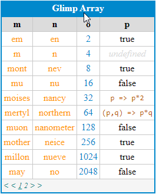

A printer for javascript content, particularly for tablular data.  Color codes data types.  Table paging available.

## Getting Started

After installing glimp, what you really want is the 'print' object.

    npm install glimp

## Printing an Array of Objects

The glimp printer can work on an array.  It is best exemplified by printing an array of objects, such as the one below:

    let array = [
        { m: 'em', n: 'en', o: 'oh' },
        { m: 'm', n: 'n', o: 'o', p: 'p' },
        { m: 'mont', n: 'nev', o: 'ore', p: 'pens' },
        { m: 'mu', n: 'nu', o: 'omicron', p: 'pi' },
        { m: 'moises', n: 'nancy', o: 'oliver', p: 'patricia' },
        { m: 'mertyl', n: 'northern', o: 'olive', p: 'peoria' },
        { m: 'muon', n: 'nanometer', o: 'ohm', p: 'parsec' },
        { m: 'mother', n: 'neice', o: 'only-child', p: 'parent' },
        { m: 'millon', n: 'nueve', o: 'ocho', p: 'primer' },
        { m: 'may', n: 'no', o: 'of-course', p: 'please' },
        { m: 'mechanic', n: 'navigator', o: 'oncologist', p: 'programmer' },
        { m: 'man', n: 'nick', o: 'open', p: 'picky' },
    ];

To use it, create an HTML `div` object (other container-type objects may work as well.  Then reference it (using querySelector syntax) as well as the object you want to print in `glimp.print`.

    

    

The code above results in the following presentation object:

