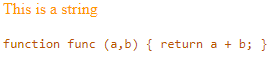
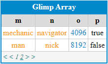
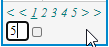

A printer for javascript content, particularly for tablular data.  Color codes output based on data type.  Table paging is available and automatic.

## Getting Started

After installing glimp, what you really want is the 'print' object.

    npm install glimp

    import { print } from './node_modules/glimp/dist/glimp.js';

Other objects, such as charting, in glimp may be made available as the need arises. That is why there is no default export structure.

In the examples below, you will see the import from a different path:

    import { print } from '../src/glimp.js';

This is simply because it is the path used when developing in the test environment of glimp itself.  

## Printing Primitives

The glimp printer can print many types of objects.  All that is required is an HTML div to print it into.  Different kinds of objects will recieve different kinds of colorizations.  

Consider a string and a function:

    let str = 'This is a string';
    function func (a,b) { return a + b; }

To use glimp, create an HTML `div` object (other container-type objects may work as well for each.  Then reference each (using querySelector syntax) as well as the object you want to print in `glimp.print`.

    

 
    

    

This will result in:

## Printing an Object

The glimp printer also works with complex objects.  Consider this object:

    let object = { 
        a: 'eigh', 
        b: 1, 
        c: 0.555,
        d: 'delta',
        e: p => p/3,
        f: undefined,
        g: false
    };

If you print it:

    

    

You will get:

## Printing an Array of Objects (with a caption)

The glimp printer can work with an array.  It is best exemplified by printing an array of objects, such as the one below:

    let array = [
        { m: 'em', n: 'en', o: 2, p: true },
        { m: 'm', n: 'n', o: 4 },
        { m: 'mont', n: 'nev', o: 8, p: true },
        { m: 'mu', n: 'nu', o: 16, p: false },
        { m: 'moises', n: 'nancy', o: 32, p: p => p*2 },
        { m: 'mertyl', n: 'northern', o: 64, p: (p,q) => p*q },
        { m: 'muon', n: 'nanometer', o: 128, p: false },
        { m: 'mother', n: 'neice', o: 256, p: true },
        { m: 'millon', n: 'nueve', o: 1024, p: true },
        { m: 'may', n: 'no', o: 2048, p: false },
        { m: 'mechanic', n: 'navigator', o: 4096, p: true },
        { m: 'man', n: 'nick', o: 8192, p: false }
    ];

Print it as with any other object.  Though, for tabular objects you can also add a third parameter providing a caption.

    

    

The code above results in the following presentation object:

Click on '2' or on either '>' to go to the next page:

The inner '<' and '>' will take you to the previous and next pages, respectively.  The outer '<' and '>' will take you to the first and last pages, respectively.   In this case, they are the same.  But with more pages, such as in the next example, they are not the same.

## Printing Large Arrays

Many arrays can be quite large. 

    let large = [];
    for (let i = 0; i <= 100; i++) 
        large.push({ a: i, b: i * 2});

Print it as before:

    

    

You will notice a little difference in the pager:

;

The nearest pages are listed explicitly, but then there is another line giving the number of pages.

Hover over this line, and you will be given an option to input the page you desire to jump to:

